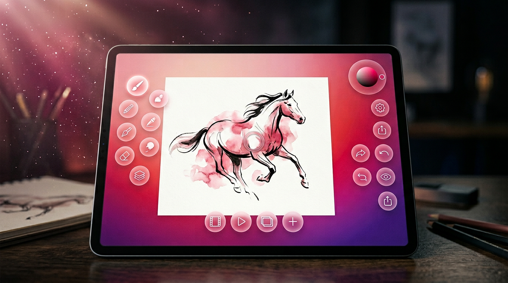
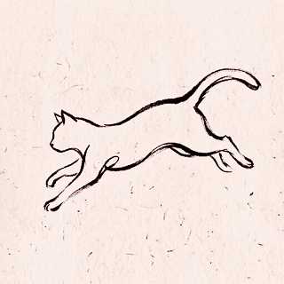

<div align="center">

# InkFrame Studio

### The Glass Horizon · A free 2D animation & drawing studio



<br/>



<br/>

**Radial glass-orb interface · stylus-first · runs anywhere HTML runs.**

[](https://github.com/artistso/inkframesv5/actions/workflows/android.yml)

</div>

---

## What is this?

InkFrame is a **2D drawing and frame-by-frame animation app** with a design that
doesn't look like anything else. Instead of docked toolbars, it fans out
**glowing rose-quartz orbs** around your canvas — brushes on the left, colour
and actions on the right, timeline along the bottom. Every tool is one tap
away and *stays out of the way of the drawing*.

The entire app is a single-file HTML build that runs in any browser and ships
as an Android APK via a thin WebView shell. That means:

- **Zero install cost** to try — open `web/index.html` in any browser.
- **Full offline** — nothing calls the network. IndexedDB autosaves the whole
  session; a phone lock, refresh, or app-switch never loses work.
- **Same code, browser and tablet** — the APK is a WebView that loads the same
  `index.html`, so what you draw in Chrome and what you draw on your tablet
  behave identically.
- **Free**, as in beer *and* as in speech. Released under the MIT License (see `LICENSE`).

## The feature list

### Drawing
- **5 built-in brushes:** pencil (graphite tooth), ink (calligraphic
  nib + tilt), marker (chisel + bleed), watercolour (wet-edge wash), glow, eraser
- **Brush Lab** — long-press any brush to open a live editor with sliders for
  size / opacity / hardness / spacing / jitter. Every value persists per brush.
  Turn any brush into charcoal or spatter with the jitter slider alone.
- **StreamLine** smoothing (0–100 % adjustable) + **QuickShape** (hold still,
  a rough stroke snaps to a clean line or ellipse — Procreate-style)
- **Catmull-Rom spline strokes** — no polygon faceting on fast curves
- **Palm rejection** and **stylus-only mode** — rest your hand freely
- **Tilt-aware** ink pen and pencil (real nib swivel + graphite laydown)
- **Living Line** — inertial nib width + orientation + a "reveal" envelope so
  strokes feel like they carry weight

### Animation
- **Multi-frame timeline** with per-frame **holds** (this frame lingers 3 ticks)
- **Layers per frame** — add / duplicate / delete / reorder, per-layer opacity,
  visibility, and 11 blend modes (Multiply, Screen, Overlay, Dodge, Burn, …)
- **Onion skin** — past frames in deep magenta, future in warm rose, extra
  "reach" while scrubbing so you can feel the arc of motion
- **Motion blur** and **dissolve** playback modes
- **Loop range** — set in/out points on the rail, isolate a beat to iterate
- **Adjustable FPS** dial (1–24 fps)

### I/O
- **Import a reference image** (PNG / JPEG / GIF / WebP) — drops in as a dim
  bottom layer for rotoscoping or tracing. Drag-and-drop onto the canvas works.
- **Export PNG** — the current frame
- **Export GIF** — animated, looping, respects per-frame holds. Pure-JS
  encoder (a 1:1 port of the Kotlin `GifEncoder` in `core-common/gif/`).
- **Export MP4 / WebM** — H.264 where the platform supports it, VP9/VP8
  otherwise. Frame-accurate, honours holds.
- **IndexedDB autosave** — 800 ms after any edit and on every visibility
  change / page-hide. Restores silently on next launch.

### Ergonomics
- **Multi-project gallery** — 4 canvases you can swap between with a cinematic
  dive transition
- **Themes**, **Zen mode**, **fullscreen**
- **Multi-touch** — 2-finger pinch scales the canvas, 2-finger tap = undo,
  3-finger tap = redo
- **PWA manifest** — installable to any browser's home screen as a standalone
  app (violet theme, landscape, embedded SVG icon)

## Try it now (no build)

Just open `web/index.html` in any browser. The whole app boots.

```bash
open web/index.html          # macOS
xdg-open web/index.html      # Linux
start web/index.html         # Windows
```

For hot-reload while hacking:

```bash
cd web
npm install
npm run dev                  # Vite dev server with HMR
```

## Build the APK

The Android app in `/app` is a lightweight WebView that loads
`web/index.html` from bundled assets. To build it:

```bash
./gradlew :app:assembleDebug
# APK lands at app/build/outputs/apk/debug/
```

Or grab a fresh debug APK from any completed Android CI run in
[Actions](https://github.com/artistso/inkframesv5/actions/workflows/android.yml).

See `BUILD.md` for release signing and `RELEASING.md` for the Play Store
pipeline.

## Release/testing helpers

- `RELEASE_CHECKLIST.md` — tablet/browser/APK smoke-test flow: backup archive → CI artifact → install → verify exports and stylus behavior.
- `RELEASE_NOTES.md` — generated tester/GitHub Release summary. Regenerate with `node tools/update-release-notes.mjs` after updating `CHANGELOG.md` / `web/metadata.json`.
- `tools/bump-version.mjs` — updates `web/metadata.json` + `web/package.json`, regenerates release notes, and runs version checks.
- `tools/prepare-release.mjs` — verifies release readiness and prints the exact `git tag` / `git push` commands for the metadata version.

## Repository layout

```
web/
├── index.html          the whole app UI + engine (single file)
├── gif-encoder.js      pure-JS GIF89a encoder (1:1 port of core-common/gif/)
├── autosave.js         IndexedDB session persistence
├── brush-math.js       pure math helpers (grain, angle ease, Catmull-Rom)
├── manifest.webmanifest  PWA install descriptor
├── package.json        Vite dev/build config
└── vite.config.js

app/                    Android WebView shell (Kotlin)
core-common/            legacy pure-Kotlin utilities (GIF encoder, undo, math)
core-model/             legacy pure-Kotlin data model (Project, Frame, Brush)
engine-gl/              legacy OpenGL ES paint engine (currently unused)
feature-canvas/         legacy Compose canvas UI (currently unused)
feature-layers/         legacy Compose layer panel (currently unused)

media/
├── hero.png            marketing hero
├── demo.gif            animated demo (built by our own encoder)
├── demo_f{1..4}.png    demo keyframes
└── ...

.github/workflows/      Android + release CI
```

The `core-*`, `engine-gl`, and `feature-*` modules are the earlier native
Kotlin implementation. They still compile and their unit tests still run in
CI, but the app doesn't depend on them anymore — the WebView route turned
out to be faster to ship and easier to iterate. See `ARCHITECTURE.md` for
the full story.

## Design language

The interface style is called **The Glass Horizon**. Every UI element is a
translucent rose-quartz orb hovering over a magenta-to-violet radial gradient.
Nodes connect via soft glowing "wires" that pulse when you open them. Icons
are hand-drawn SVGs in the same line style (the entire icon set lives in
`ICONS = { ... }` inside `index.html`).

The one non-orb affordance is the canvas itself — always cream-pink paper,
always front-and-centre.

## Contributing

Open a pull request against `main`. Every push runs the Android debug APK
build and the Kotlin unit-test suite in CI (see `.github/workflows/android.yml`).

Meaningful changes should update `CHANGELOG.md`.

## License

Free to use, modify, and redistribute under the MIT License. See `LICENSE`.

## Privacy

InkFrame is designed to run offline. See `PRIVACY.md` for the Play Store/data-safety notes.

<div align="center">

*Built with the Glass Horizon design system · runs on stylus, finger, or mouse.*

</div>
